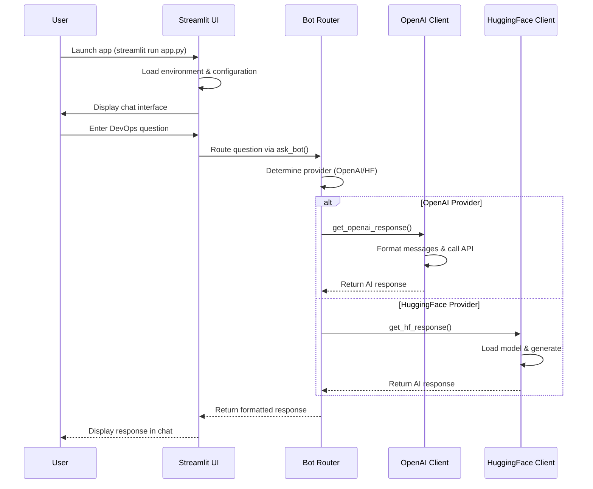

# CloudyBot: Complete Code Flow Demo 🚀

This document demonstrates the complete code execution flow of CloudyBot from startup to response generation, perfect for technical demos and understanding the architecture.

## Table of Contents
- [🎯 Overview](#-overview)
- [🏁 Application Startup](#-application-startup)
- [⚙️ Configuration Loading](#️-configuration-loading)
- [🎨 UI Initialization](#-ui-initialization)
- [💬 User Interaction Flow](#-user-interaction-flow)
- [🤖 AI Processing](#-ai-processing)
- [📊 Response Generation](#-response-generation)
- [🔄 Complete Example](#-complete-example)

---

## 🎯 Overview

CloudyBot follows a simple yet powerful architecture:



---

## 🏁 Application Startup

### Entry Point: `app.py`

```python
# app.py - Line 1-35
"""
CloudyBot Streamlit Application
Main entry point for the DevOps AI assistant
"""
import os
import streamlit as st
from dotenv import load_dotenv
from bot import ask_bot

# Page configuration - First thing executed
st.set_page_config(
    page_title="CloudyBot - DevOps Assistant",
    page_icon="☁️",
    layout="wide",
    initial_sidebar_state="expanded"
)
```

**🔍 What happens here:**
1. Streamlit imports and configures the web interface
2. Custom modules (`bot`, `dotenv`) are loaded
3. Page metadata is set (title, icon, layout)

---

## ⚙️ Configuration Loading

### Environment Setup

```python
# app.py - Line 36-45
# Load environment variables from .env file
load_dotenv()

def get_config(key, default_value):
    """Get configuration from Streamlit secrets or environment variables"""
    try:
        return st.secrets.get(key, os.getenv(key, default_value))
    except:
        return os.getenv(key, default_value)

# Configuration priority: Streamlit Secrets > .env file > defaults
DEFAULT_PROVIDER = st.secrets.get("MODEL_PROVIDER", os.getenv("MODEL_PROVIDER", "OPENAI")).upper()
OPENAI_API_KEY = st.secrets.get("OPENAI_API_KEY", os.getenv("OPENAI_API_KEY", ""))
OPENAI_MODEL = st.secrets.get("OPENAI_MODEL", os.getenv("OPENAI_MODEL", "gpt-3.5-turbo"))
HUGGINGFACE_MODEL = st.secrets.get("HUGGINGFACE_MODEL", os.getenv("HUGGINGFACE_MODEL", "google/flan-t5-base"))
```

**🔍 Configuration Priority:**
1. **Streamlit Secrets** (for cloud deployment)
2. **Environment Variables** (from .env file)
3. **Hardcoded Defaults** (fallback values)

### Example .env File
```bash
MODEL_PROVIDER=OPENAI
OPENAI_API_KEY=sk-your-api-key-here
OPENAI_MODEL=gpt-3.5-turbo
HUGGINGFACE_MODEL=google/flan-t5-base
```

---

## 🎨 UI Initialization

### Session State Setup

```python
# app.py - Line 50-52
# Initialize session state for chat history
if "messages" not in st.session_state:
    st.session_state.messages = []
```

### Streamlit Interface Components

```python
# app.py - Line 75-95
def main():
    # Title and description
    st.title("☁️ CloudyBot: DevOps Assistant")
    st.markdown("""
        <div style='background-color: #f8f9fa; padding: 1rem; border-radius: 5px;'>
        CloudyBot is an AI-powered assistant for DevOps and cloud-related questions.
        </div>
    """, unsafe_allow_html=True)
    
    # Sidebar for settings
    with st.sidebar:
        provider = st.radio(
            "Select AI Provider:",
            options=["OpenAI", "Hugging Face"],
            index=0 if DEFAULT_PROVIDER == "OPENAI" else 1
        )
```

**🔍 UI Components:**
- **Main Chat Area**: Displays conversation history
- **Sidebar**: Model selection and example queries
- **Input Box**: User message input
- **Settings Panel**: Provider and model configuration

---

## 💬 User Interaction Flow

### Message Input Processing

```python
# app.py - Line 140-160
# Chat input with modern API
if prompt := st.chat_input("Ask CloudyBot a DevOps question..."):
    # Add user message to chat history
    st.session_state.messages.append({"role": "user", "content": prompt})
    
    # Generate and display response
    with st.chat_message("assistant"):
        with st.spinner("CloudyBot is thinking..."):
            response = ask_bot(
                prompt, 
                st.session_state.messages[:-1], 
                provider.upper().replace(" ", ""),
                model
            )
        st.markdown(response)
    
    # Add assistant response to chat history
    st.session_state.messages.append({"role": "assistant", "content": response})
```

**🔍 Flow Steps:**
1. User types message in chat input
2. Message added to session state
3. Spinner shows "thinking" status
4. `ask_bot()` function called with parameters
5. Response displayed and added to history

---

## 🤖 AI Processing

### Bot Router: `bot.py`

```python
# bot.py - Complete file
from dotenv import load_dotenv
from openai_client import get_openai_response
from hf_client import get_hf_response

def ask_bot(question, chat_history=None, provider="OPENAI", model=None):
    """Route the question to appropriate AI provider and return response."""
    try:
        if provider == "OPENAI":
            return get_openai_response(question, chat_history, model)
        elif provider == "HUGGINGFACE":
            return get_hf_response(question, chat_history)
        else:
            return f"Error: Unknown provider {provider}"
    except Exception as e:
        return f"Error: {str(e)}"
```

**🔍 Router Logic:**
- Acts as dispatcher between different AI providers
- Handles provider-specific function calls
- Includes error handling and fallbacks

---

## 📊 Response Generation

### OpenAI Provider: `openai_client.py`

```python
# openai_client.py - Key functions
from openai import OpenAI
import os

client = OpenAI(api_key=os.getenv("OPENAI_API_KEY"))

def get_openai_response(question, chat_history=None, model="gpt-3.5-turbo"):
    """Generate response using OpenAI API."""
    try:
        # Prepare messages
        messages = []
        
        # Add chat history (last 5 messages for context)
        if chat_history:
            messages.extend([
                {"role": msg["role"], "content": msg["content"]}
                for msg in chat_history[-5:]
            ])
        
        # Add current question
        messages.append({"role": "user", "content": question})
        
        # Call OpenAI API
        response = client.chat.completions.create(
            model=model,
            messages=messages,
            temperature=0.7,
            max_tokens=1000,
        )
        
        return response.choices[0].message.content.strip()
    except Exception as e:
        return f"Error calling OpenAI API: {str(e)}"
```

### Hugging Face Provider: `hf_client.py`

```python
# hf_client.py - Key functions
import torch
from transformers import AutoModelForSeq2SeqLM, AutoTokenizer

# Global model cache
model = None
tokenizer = None

def load_model(model_path=None):
    """Load the Hugging Face model and tokenizer."""
    global model, tokenizer
    
    if model is None or tokenizer is None:
        model_path = model_path or "google/flan-t5-base"
        
        print(f"Loading model: {model_path}")
        tokenizer = AutoTokenizer.from_pretrained(model_path)
        model = AutoModelForSeq2SeqLM.from_pretrained(model_path)
        print(f"Model loaded successfully: {model_path}")
    
    return model, tokenizer

def get_hf_response(question, chat_history=None, temperature=0.7):
    """Generate response using Hugging Face model."""
    model, tokenizer = load_model()
    
    # Prepare input with chat history
    input_text = question
    if chat_history:
        history_text = "\n".join([
            f"{m['role']}: {m['content']}" 
            for m in chat_history[-3:]
        ])
        input_text = f"{history_text}\nuser: {question}"
    
    # Tokenize and generate
    inputs = tokenizer(input_text, return_tensors="pt", padding=True, truncation=True)
    outputs = model.generate(
        **inputs,
        max_length=512,
        do_sample=True,
        temperature=temperature,
        top_p=0.9,
    )
    
    response = tokenizer.decode(outputs[0], skip_special_tokens=True)
    return response
```

**🔍 Provider Differences:**
- **OpenAI**: API-based, fast, requires internet + API key
- **Hugging Face**: Local model, slower first load, works offline

---

## 🔄 Complete Example

### Demo Scenario: "How do I restart a Kubernetes pod?"

Let's trace a complete request through the system:

#### 1. User Input
```
User types: "How do I restart a Kubernetes pod?"
```

#### 2. Streamlit Processing
```python
# app.py receives input
prompt = "How do I restart a Kubernetes pod?"
st.session_state.messages.append({"role": "user", "content": prompt})
```

#### 3. Bot Router Call
```python
# Calls bot.py
response = ask_bot(
    prompt="How do I restart a Kubernetes pod?",
    chat_history=[],  # Empty for first message
    provider="OPENAI",
    model="gpt-3.5-turbo"
)
```

#### 4. OpenAI Client Processing
```python
# openai_client.py processes request
messages = [
    {"role": "user", "content": "How do I restart a Kubernetes pod?"}
]

response = client.chat.completions.create(
    model="gpt-3.5-turbo",
    messages=messages,
    temperature=0.7,
    max_tokens=1000,
)
```

#### 5. API Response
```json
{
  "choices": [{
    "message": {
      "content": "To restart a Kubernetes pod, you have several options:\n\n1. **Delete the pod** (recommended):\n```bash\nkubectl delete pod <pod-name> -n <namespace>\n```\n\n2. **Restart deployment**:\n```bash\nkubectl rollout restart deployment <deployment-name> -n <namespace>\n```\n\n3. **Scale down and up**:\n```bash\nkubectl scale deployment <deployment-name> --replicas=0 -n <namespace>\nkubectl scale deployment <deployment-name> --replicas=1 -n <namespace>\n```\n\nThe deployment controller will automatically create a new pod to replace the deleted one."
    }
  }]
}
```

#### 6. Response Display
```python
# Back in app.py
st.session_state.messages.append({
    "role": "assistant", 
    "content": response
})
st.markdown(response)  # Displays formatted response
```

#### 7. Final UI State
```
💬 Chat History:
User: How do I restart a Kubernetes pod?
CloudyBot: To restart a Kubernetes pod, you have several options:

1. **Delete the pod** (recommended):
```bash
kubectl delete pod <pod-name> -n <namespace>
```
[... full response displayed with syntax highlighting ...]
```

---

## 🚀 Performance Considerations

### OpenAI Provider
- **Response Time**: 2-5 seconds
- **Memory Usage**: ~50MB
- **Requirements**: Internet + API key
- **Cost**: Per API call

### Hugging Face Provider
- **First Load**: 30-60 seconds (model download)
- **Subsequent**: 5-10 seconds
- **Memory Usage**: 2-4GB RAM
- **Requirements**: Local compute
- **Cost**: Free

---

## 🔧 Debugging & Development

### Adding Debug Prints
```python
# In bot.py
def ask_bot(question, chat_history=None, provider="OPENAI", model=None):
    print(f"🤖 Processing: {question[:50]}...")
    print(f"📡 Provider: {provider}")
    print(f"🧠 Model: {model}")
    
    try:
        if provider == "OPENAI":
            response = get_openai_response(question, chat_history, model)
            print(f"✅ Response length: {len(response)} chars")
            return response
        # ... rest of function
```

### Environment Validation
```python
# Add to app.py startup
def validate_environment():
    """Check if environment is properly configured"""
    issues = []
    
    if not os.getenv("OPENAI_API_KEY") and DEFAULT_PROVIDER == "OPENAI":
        issues.append("❌ OpenAI API key missing")
    
    if not torch.cuda.is_available() and DEFAULT_PROVIDER == "HUGGINGFACE":
        issues.append("⚠️ CUDA not available (will use CPU)")
    
    return issues
```

This completes the comprehensive code flow demonstration for CloudyBot! 🎉 